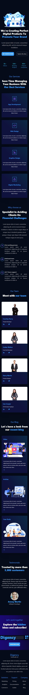

# Digency
Simple Home Page

## Features
- [x] Dark/Light Theme
- [x] Responsive Design
- [x] Reusable Components
- [x] Carousel

## Dependencies
- Vite
- Qwik
- TailWindCSS

## About

<div align="center">


<br/>
<br/>

🚀 Watch a demo [here!](https://da8ah.github.io/qwik-digency-home/)
</div>
<br/>

The web application is a marketing agency called Digency, which offers web design, SEO, social media and online advertising services. It is responsive and adapts to different screen sizes and devices. You can also see different animations and effects.

This project is a web application built with [Vite](https://qwik.builder.io/docs/advanced/vite/), a next generation frontend tooling that provides fast development and optimized production builds. [Qwik](https://qwik.builder.io/), a framework for building resumable applications that load instantly on the client. It uses [Tailwind](https://qwik.builder.io/docs/integrations/tailwind/) too, a design system that makes it easy to create custom user interfaces.

## Local Setup

- PNPM
```bash
$ npm i --location=global pnpm
```
- Install dependencies and Run
```bash
$ git clone https://github.com/da8ah/qwik-digency-home.git
$ pnpm install
$ pnpm run dev
```

- Static Site Generator for GitHub Pages
```bash
$ npm run qwik add > Adapter: Static site (.html files)
```


## Results

### Responsive Design

You can find a full working version in the [Demo](https://da8ah.github.io/qwik-digency-home/).

|Mobile|Tablet|Desktop|
|:------------:|:------------:|:------------:|
||||
<br/>

### Animations

Dark/Light Theme

<div align="center" style="width:100%;display:flex;flex-direction:column;justify-content:space-evenly;align-items:center;">

<br/>
<br/>

</div>
<br/>

Mobile Navbar

<div align="center" style="width:100%;display:flex;flex-direction:row;justify-content:space-evenly;align-items:flex-start;">
 

</div>
<br/>

Navbar Hover

<div align="center" style="width:100%;display:flex;flex-direction:column;justify-content:space-evenly;align-items:center;">

<br/>
<br/>

<br/>
<br/>

<br/>
<br/>

</div>
<br/>

Cards

<div align="center" style="width:100%;display:flex;flex-direction:column;justify-content:space-evenly;align-items:center;">

<br/>
<br/>

</div>
<br/>

Carousel

<div align="center" style="width:100%;display:flex;flex-direction:column;justify-content:space-evenly;align-items:center;">

<br/>
<br/>

</div>
<br/>

Gradient & Button hover/focus Shadow

<div align="center" style="width:100%;display:flex;flex-direction:column;justify-content:space-evenly;align-items:center;">

</div>
<br/>
<br/>

## Changelog

(Tiber) **Abril 2023 v1.0.0**
* Navbar
* Hero
* Stats
* Services
* Features
* Team
* Blog
* Testimonials
* Newsletter
* Footer